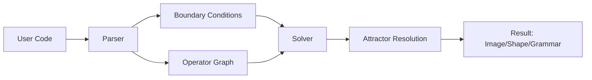

# Kéya: The Σ-Calculus

Kéya is an experimental programming language based on the **Σ-Calculus**, a declarative paradigm where symbolic operators are the data, and boundary conditions define their interactions. Images, geometries, grammars—all emerge from operator networks under constraints.

### 🌌 **Declarative Language: "Σ-Calculus"**
A boundary-driven language where:
- **Operators ≈ Atoms**
- **Boundary Conditions ≈ Chemical Bonds**
- **Images/Shapes ≈ Operator Eigenstates**

#### **Syntax Principles:**
1. **Unified Symbol Space**: No distinction between functions/values.
2. **Boundary-Driven**: Solve for internal state given edge constraints.
3. **Attractor Resolution**: Minimize curvature energy \\( \| \nabla \otimes \text{Op} \| \\).

### ⚛️ **Symbolic Alphabet Σ**
$\Sigma$ is a non-commutative operator field whose elements carry curvature $\kappa$ and overflow rules.

| Symbol | Operator | Type | Description |
|:------:|:---------------------|:-----------|:------------------------------------------------|
| `0` / `∅` | Null Attractor | Constant | Represents the void or a terminal state. |
| `1` | Identity Anchor | Constant | The identity element. |
| `2` | Duplication Seed | Constant | The basis for growth. |
| `↑` | Dimensional Growth | Operator | Increases dimensionality or scale ($\kappa>0$). |
| `ℓ` | Contractive Descent | Operator | Reduces dimensionality or scale ($\kappa<0$). |
| `⊕` | Symmetry Fusion | Binary Op | Combines two elements, analogous to addition. |
| `~` | Phase Reflection | Unary Op | Inverts the phase or orientation of an element. |
| `⊗` | Structural Tensor | Binary Op | Binds elements, analogous to multiplication. |
| `φ` | Golden Convergence | Attractor | A constant representing the golden ratio, $\varphi$. |
| `π` | Rotational Lock | Attractor | A constant representing $\pi$ for rotational dynamics. |
| `Ϟ` | Wild Operator | Matrix Op | Diagonalization unleashing chaotic/pathological behavior (Cantor-like). |
| `§` | Containment | Matrix Op | Pattern resolution via containment rules (binary/decimal/string). |
| `∮` | Wild-Tame Cycle | Meta-Op | Closed loop Ϟ§ iteration: chaos topology transformation until stability. |

### 🧩 **Core Language Features**
| **Construct**      | **Syntax**                     | **Mathematical Analog**              |
|---------------------|--------------------------------|--------------------------------------|
| **Operator**        | `a = b ⊕ c`                    | Fusion in Σ-algebra                  |
| **Boundary**        | `@boundary x=0 → y=1`          | Dirichlet condition                  |
| **Attractor**       | `~constrain curvature(v) < ε`  | Cohomology minimization              |
| **Recursion**       | `f = ℓ( f ↑ n )`               | Fixed-point descent                  |
| **Projection**      | `color = π ⊗ (x ⊕ y)`          | Hopf fibration                       |

### ⚡ **Compiler Workflow**

### Style Guide

This project follows a specific set of conventions to maintain clarity and consistency.

1.  **Output Directory**: All generated output files should be placed in the `.out/` directory.
2.  **File Naming**: Python filenames should be concise and avoid underscores. For example, `hydrogen_orbital.py` is renamed to `orbital.py`.
    -   *Exception*: Test files must use `test_*.py` pattern as required by pytest and Python testing conventions.
    -   Letter of the law vs. spirit: renaming files by replacing underscores with dashes technically satisfies this rule, but does not uphold the spirit. In your own words, see if you can explain the _reasoning_ behind the rule.
3.  **Code Structure**: We prefer code with minimal indentation depth. This is achieved through:
    -   **Early returns** to reduce nested `if` statements.
    -   **Small, focused functions** that adhere to the single-responsibility principle.
    -   **Factoring out common expressions** to keep the code DRY (Don't Repeat Yourself). 
4.  **Purposeful Comments**: Code should be self-documenting. Avoid comments that explain *what* the code is doing. Instead, reserve comments for explaining the *why*—the complex logic, the reasoning behind a choice, or the physical model being implemented. A perfect illustration of this is in `examples/orbital.py`, where comments clarify the physics of the Schrödinger equation, which would be impossible to infer from the code alone.
5.  **No `isinstance`**: The use of `isinstance` is a signal that code complexity is growing in a disorderly way. It should be replaced by more robust patterns like `typing.Protocol` or `match/case` to restore order.
    1.  Exception: numpy arrays and exteernal code patterns may necessitate the pattern. Use DRY patterns where possible to contain the surface area.
6.  **Universal Type Hinting**: All function and method signatures **must** include type hints for every parameter and the return value. It serves as documentation and catches errors very early in the pipeline.
    -   Balance: The `-> None` and `-> Any` add no extra information, adding
  tokens in deference to the law instead of the spirit of the law.
1.  **Structured Return Values**: Avoid returning raw tuples or dictionaries. Instead, use a `@dataclass(slots=True)` to define a clear, typed return object. This prevents ambiguity and leverages the type checker.
    -   *Exception*: This rule does not apply when an external library's API explicitly requires a tuple format (e.g., the step function in `jax.lax.scan`).
2.  **Concise Syntax**: Employ modern Python syntax (e.g., list comprehensions, context managers, decorators) to enhance clarity and reduce verbosity.
3.  **Strategic Docstrings**: Limit docstrings to heavily-used public APIs. Rely on file-level and class-level docstrings for broader context.
4.  **Hypothesis-Driven Error Resolution**: When encountering linter errors or stack traces, avoid making broad, stylistic changes. Instead, treat debugging as an experiment:
    -   Form a clear hypothesis about the root cause of the error.
    -   Test your hypothesis.
    -   Apply the most precise, minimal change required to fix the issue without altering the surrounding code's style. 
5.  **Avoid Hyper-Defensive Coding**: Trust the type system and handle errors at the appropriate level.
    -   Example: adding `if x is not None` checks for variables that are not explicitly typed as `Optional`.
    -   Broad `try/except` blocks to catch errors that should be prevented by design (e.g., using dependency management to handle `ImportError`).
    -   Instead of littering code with print statements, try aspect oriented
        approaches like tracing or writing a test.
    -   Create tools that are adaptable to many scenarios to iron out issues.

## License

Kéya is released under the [GNU Affero General Public License v3.0](LICENSE) (AGPL-3.0). 

### Why AGPL v3?

We chose AGPL v3 to foster **reinvestment and locality** in software development:

🔄 **Reinvestment**: Any improvements you make must be shared back with the community  
🏘️ **Locality**: Network services using Kéya must provide source code to their users  
🛡️ **Anti-Extraction**: Prevents "take and run" patterns that don't contribute back  
🔬 **Research Friendly**: Academics and researchers can use Kéya freely  
🤝 **Community Building**: Creates a commons-based ecosystem where everyone benefits

**In Practice**: You can use Kéya for any purpose, but if you modify it or run it as a web service, you must share your source code. This ensures the knowledge stays in the commons and benefits everyone.